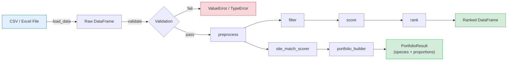

# Tree Species Selector

A Nature-based Solutions (NbS) decision-support library that filters,
scores, ranks, and composes tree-species portfolios by climate zone, soil
type, rainfall tolerance, and ecological traits -- helping foresters and
land-use planners choose the best candidates for reforestation and
agroforestry projects.

---

## Overview

Picking the right species for a reforestation site is a multi-criteria
problem: candidates must survive the local climate and soil, deliver on
project goals (carbon, timber, livelihoods, ecosystem services), and
ideally form a mixed, ecologically diverse plantation rather than a
monoculture. This library provides four composable building blocks:

| Module | What it answers |
|---|---|
| `SpeciesSelector` (`src/main.py`) | *Which candidates survive my constraints, and how do they rank by traits?* |
| `site_match_scorer` | *Given a specific site (rainfall / temperature / soil), how well does each candidate fit?* |
| `species_diversity_scorer` | *How diverse is my proposed planting plan (Shannon, Simpson, evenness, functional diversity)?* |
| `portfolio_builder` | *Which optimal **mix** of species should I plant at this site and in what proportions?* |

All data transformations are **immutable** -- inputs are never mutated,
every function returns a new DataFrame. Every public entry point
validates its arguments at the system boundary and raises clear
`ValueError` / `TypeError` messages for malformed input.

### Feature highlights

- **Multi-criteria filtering** -- climate zone, rainfall range, soil type, native status, drought tolerance, agroforestry suitability
- **Composite suitability scoring** -- weighted index over carbon sequestration, growth rate, native status, agroforestry fit, drought tolerance; weights are configurable
- **Site-match scoring** -- rainfall / temperature envelope decay, soil-compatibility groups (e.g. loam and clay_loam partially compatible)
- **Diversity indices** -- Shannon H', Simpson D, Pielou's evenness, mean pairwise trait distance
- **Portfolio builder (NEW)** -- greedy diversity-aware optimisation that returns a small set of species with assigned proportions summing to 1.0
- **CSV and Excel I/O** -- `.csv`, `.xlsx`, `.xls`
- **30-row realistic demo dataset** -- tropical, subtropical, temperate, boreal, and arid species relevant to Indonesian / SE-Asian reforestation contexts
- **200+ pytest tests** -- unit, integration, parametrized, and edge-case coverage

---

## Installation

Requires Python 3.9 or newer.

```bash
git clone https://github.com/achmadnaufal/tree-species-selector.git
cd tree-species-selector
python -m venv .venv
source .venv/bin/activate        # Windows: .venv\Scripts\activate
pip install -r requirements.txt
```

Verify the install by running the test suite:

```bash
pytest tests/ -v
```

---

## Quick Start

```python
from src.main import SpeciesSelector

selector = SpeciesSelector()
df = selector.load_data("demo/sample_data.csv")
ranked = selector.rank(df, top_n=5)
print(ranked[["rank", "species_name", "suitability_score"]])
```

Or, build an optimal diverse portfolio for a specific site in four lines:

```python
from src.site_match_scorer import Site
from src.portfolio_builder import build_portfolio

site = Site(rainfall_mm=1800, temperature_c=27, soil_type="loam")
result = build_portfolio(df, site, portfolio_size=4)
print(result.portfolio[["rank", "species_name", "site_match_score", "proportion"]])
```

---

## Step-by-Step Usage

### 1. Load and inspect the dataset

```python
from src.main import SpeciesSelector

selector = SpeciesSelector()
df = selector.load_data("demo/sample_data.csv")
print(f"Loaded {len(df)} species")
```

### 2. Filter by environmental criteria

```python
filtered = selector.filter(
    df,
    climate_zone="tropical",
    min_rainfall_mm=1200,
    max_rainfall_mm=2500,
    soil_type="loam",
)
print(filtered[["species_name", "climate_zone", "soil_type", "growth_rate_m_yr"]])
```

### 3. Rank species by composite suitability score

```python
tropical = selector.filter(df, climate_zone="tropical")
ranked = selector.rank(tropical, top_n=5)
print(ranked[["rank", "species_name", "suitability_score",
              "growth_rate_m_yr", "carbon_seq_tc_ha_yr"]])
```

### 4. Customise scoring weights

```python
selector = SpeciesSelector(
    config={
        "score_weights": {
            "carbon":       0.50,   # prioritise carbon sequestration
            "growth":       0.30,
            "native":       0.10,
            "agroforestry": 0.05,
            "drought":      0.05,
        }
    }
)
ranked = selector.rank(df, top_n=5)
```

### 5. Score against a specific planting site

```python
from src.site_match_scorer import Site, recommend_for_site

site = Site(rainfall_mm=1800, temperature_c=27, soil_type="loam",
            name="West Java block")
top3 = recommend_for_site(df, site, top_n=3)
print(top3[["rank", "species_name", "site_match_score",
            "rainfall_match", "temperature_match", "soil_match"]])
```

### 6. Build a diverse species portfolio

```python
from src.portfolio_builder import build_portfolio, compare_portfolios

result = build_portfolio(df, site, portfolio_size=4, alpha=0.6)
print(result.summary)
print(result.portfolio[["rank", "species_name", "site_match_score",
                        "diversity_contribution", "proportion"]])

# Sensitivity: compare different fit-vs-diversity trade-offs
comparison = compare_portfolios(df, site, alphas=[0.0, 0.3, 0.6, 1.0])
print(comparison)
```

### 7. Evaluate ecological diversity of any plan

```python
import pandas as pd
from src.species_diversity_scorer import compute_diversity

plan = pd.DataFrame({
    "species_name":        ["Teak",  "Sengon", "Albizzia", "Jabon"],
    "proportion":          [0.40,    0.30,     0.20,       0.10],
    "growth_rate_m_yr":    [1.5,     3.5,      2.0,        2.8],
    "carbon_seq_tc_ha_yr": [8.2,     13.2,     7.5,        10.7],
})
result = compute_diversity(plan)
print(result.summary)
# Species: 4 | Shannon H' = 1.279 | Simpson D = 0.700 | ...
```

### 8. Run the full pipeline on a CSV

```python
result = selector.run("demo/sample_data.csv")
print(f"Total records: {result['total_records']}")
```

---

## Selection Methodology

### Composite suitability score (`SpeciesSelector.score`)

The trait-based score is a weighted sum of normalised indicators, scaled
to the range **[0, 100]**:

| Indicator | Default weight | Rationale |
|---|---:|---|
| Carbon sequestration (`carbon_seq_tc_ha_yr`) | **40%** | Primary NbS objective |
| Growth rate (`growth_rate_m_yr`) | 30% | Time-to-canopy-closure, yield |
| Native status (`native`) | 15% | Ecological integrity, fewer risks |
| Agroforestry suitability | 10% | Livelihood co-benefits |
| Drought tolerance | 5% | Climate resilience |

Numeric indicators are min-max normalised across the candidate set;
booleans map to 0 / 1. Custom weights can be provided via
`config={"score_weights": ...}` and need not sum to 1.

### Site-match score (`site_match_scorer.score_site_match`)

For a given `Site(rainfall_mm, temperature_c, soil_type)`, each species
receives three sub-scores in `[0, 1]`:

- **Rainfall match** -- 1.0 inside `[min_rainfall_mm, max_rainfall_mm]`;
  decays linearly to 0 across a configurable tolerance margin
  (default 500 mm).
- **Temperature match** -- analogous to rainfall over a 5 deg C margin
  (configurable).
- **Soil match** -- 1.0 exact, 0.5 for compatible soils (e.g. loam and
  clay_loam), 0.0 otherwise.

Weights default to `{rainfall: 0.4, temperature: 0.4, soil: 0.2}` and
can be overridden per call.

### Diversity indices (`species_diversity_scorer.compute_diversity`)

- **Shannon H'** (nats): `-sum(p_i * ln(p_i))`
- **Simpson D**: `1 - sum(p_i^2)`
- **Pielou's evenness J'**: `H' / ln(S)` (S = species count)
- **Functional diversity**: mean pairwise Euclidean distance between
  species in a min-max normalised trait space.

### Portfolio builder (`portfolio_builder.build_portfolio`)

Greedy diversity-aware selection:

1. Score all candidates against the site; drop those below
   `min_site_score` (default 0.3).
2. Seed the portfolio with the highest site-match species.
3. Iteratively add the candidate that maximises

        objective(s) = alpha * site_match_score(s)
                     + (1 - alpha) * mean_trait_distance(s, portfolio)

   where `alpha` (default 0.6) trades off site fit against functional
   diversity.
4. Stop after `portfolio_size` species (or the pool is exhausted).
5. Assign proportions proportionally to each species's objective
   value (normalised to sum to 1.0); when all objectives are zero,
   fall back to an equal split.

---

## Species Database

The bundled demo dataset at `demo/sample_data.csv` contains **30 realistic
species** spanning tropical, subtropical, temperate, boreal, and arid
climate zones, with a focus on Indonesian / SE-Asian reforestation
species. Representative entries include:

| species_name | scientific_name | climate_zone | soil_type | growth (m/yr) | carbon (t/ha/yr) |
|---|---|---|---|---:|---:|
| Teak | *Tectona grandis* | tropical | loam | 1.5 | 8.2 |
| Mahogany | *Swietenia macrophylla* | tropical | clay_loam | 1.2 | 9.1 |
| Acacia | *Acacia mangium* | tropical | sandy_loam | 2.5 | 11.4 |
| Sengon | *Paraserianthes falcataria* | tropical | loam | 3.5 | 13.2 |
| Shorea (Meranti) | *Shorea leprosula* | tropical | clay_loam | 1.6 | 10.3 |
| Bamboo (Petung) | *Dendrocalamus asper* | tropical | clay_loam | 4.0 | 16.5 |
| Oak | *Quercus robur* | temperate | loam | 0.6 | 4.3 |
| Scots Pine | *Pinus sylvestris* | boreal | sandy | 0.9 | 4.8 |
| Neem | *Azadirachta indica* | tropical | sandy_loam | 1.3 | 4.5 |
| Mimosa | *Leucaena leucocephala* | arid | sandy_loam | 2.0 | 5.6 |

Full schema per row:

```
species_name, scientific_name, climate_zone, min_rainfall_mm,
max_rainfall_mm, min_temp_c, max_temp_c, soil_type, growth_rate_m_yr,
carbon_seq_tc_ha_yr, native, drought_tolerant, suitable_for_agroforestry
```

Accepted categorical values:

- `climate_zone`: `tropical`, `subtropical`, `temperate`, `boreal`, `arid`
- `soil_type`: `loam`, `clay`, `sandy`, `clay_loam`, `sandy_loam`, `silt`, `peat`

You can drop your own data into `data/` (gitignored) and load it with
`selector.load_data("data/my_file.csv")`.

---

## Sample Output

```
=== Load Dataset ===
Loaded 30 species from demo/sample_data.csv

=== Top 5 Tropical Species by Suitability ===
 rank         species_name  suitability_score  growth_rate_m_yr  carbon_seq_tc_ha_yr
    1      Bamboo (Petung)              100.0               4.0                 16.5
    2        Bamboo (Moso)               97.8               3.0                 15.0
    3               Sengon               85.3               3.5                 13.2
    4               Acacia               74.1               2.5                 11.4
    5                Jabon               68.9               2.8                 10.7

=== Portfolio for Site(rainfall_mm=1800, temp=27, soil=loam) ===
 rank   species_name  site_match_score  diversity_contribution  proportion
    1  Bamboo (Petung)             1.000                  0.0000      0.2305
    2           Jabon             1.000                  0.5123      0.2778
    3         Acacia              1.000                  0.3891      0.2451
    4          Sengon             1.000                  0.2504      0.2466
```

---

## Running Tests

```bash
pytest tests/ -v
pytest tests/ -v --cov=src --cov-report=term-missing
```

Expected output:

```
tests/test_selector.py::TestFilterByClimateZone::test_tropical_returns_only_tropical_species PASSED
...
============================== 200+ passed in 0.55s ==============================
```

---

## Architecture



---

## Project Structure

```
tree-species-selector/
|-- src/
|   |-- __init__.py                  # Public API exports
|   |-- main.py                      # SpeciesSelector core class
|   |-- data_generator.py            # Sample data generators
|   |-- site_match_scorer.py         # Per-site fit scoring
|   |-- species_diversity_scorer.py  # Shannon / Simpson / functional diversity
|   `-- portfolio_builder.py         # Greedy diverse portfolio optimiser
|-- demo/
|   `-- sample_data.csv              # 30-row realistic species dataset
|-- sample_data/
|   `-- sample_data.csv              # Lightweight sample for quick testing
|-- tests/
|   |-- __init__.py
|   |-- test_selector.py             # 60+ tests for SpeciesSelector
|   |-- test_data_generator.py
|   |-- test_site_match_scorer.py
|   |-- test_species_diversity_scorer.py
|   `-- test_portfolio_builder.py    # 35+ tests for the portfolio module
|-- examples/
|   `-- basic_usage.py               # Runnable end-to-end demo
|-- data/                            # Drop your own data here (gitignored)
|-- .gitignore
|-- CHANGELOG.md
|-- LICENSE
|-- requirements.txt
`-- README.md
```

---

## License

Released under the **MIT License** -- see [LICENSE](./LICENSE) for full
terms. You are free to use, modify, distribute, and sublicense this
software in commercial and non-commercial projects, provided the original
copyright notice is preserved.

---

> Built by [Achmad Naufal](https://github.com/achmadnaufal) | Lead Data Analyst | Power BI, SQL, Python, GIS
