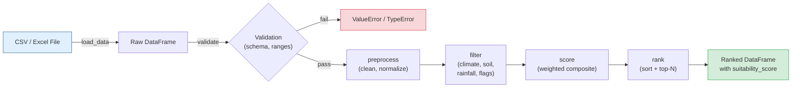

# Tree Species Selector

A decision-support library that filters, scores, and ranks tree species by
climate zone, soil type, rainfall tolerance, and ecological traits — helping
foresters and land-use planners choose the best candidates for reforestation
and agroforestry projects.

---

## Features

- **Multi-criteria filtering** — narrow candidates by climate zone, rainfall range, soil type, native status, drought tolerance, and agroforestry suitability
- **Composite suitability scoring** — weighted index combining carbon sequestration, growth rate, native status, agroforestry fit, and drought tolerance
- **Configurable weights** — override default scoring weights via a config dict
- **Immutable pipeline** — original DataFrames are never mutated; every operation returns a new copy
- **Input validation** — rejects negative rainfall, invalid climate zones, and malformed data with clear error messages
- **CSV and Excel support** — load `.csv`, `.xlsx`, or `.xls` files
- **30-species demo dataset** — realistic tropical, subtropical, temperate, and boreal species with Indonesian/tropical reforestation context
- **60+ pytest tests** — full coverage of filtering, scoring, ranking, edge cases, and the data generator

---

## Quick Start

```bash
git clone https://github.com/achmadnaufal/tree-species-selector.git
cd tree-species-selector
python -m venv .venv && source .venv/bin/activate   # Windows: .venv\Scripts\activate
pip install -r requirements.txt
```

```python
from src.main import SpeciesSelector

selector = SpeciesSelector()
df = selector.load_data("demo/sample_data.csv")
ranked = selector.rank(df, top_n=5)
print(ranked[["rank", "species_name", "suitability_score"]])
```

---

## Usage

### 1. Load and inspect the dataset

```python
from src.main import SpeciesSelector

selector = SpeciesSelector()
df = selector.load_data("demo/sample_data.csv")
print(f"Loaded {len(df)} species")
```

### 2. Filter by environmental criteria

```python
filtered = selector.filter(
    df,
    climate_zone="tropical",
    min_rainfall_mm=1200,
    max_rainfall_mm=2500,
    soil_type="loam",
)
print(filtered[["species_name", "climate_zone", "soil_type", "growth_rate_m_yr"]])
```

### 3. Rank species by suitability score

```python
tropical = selector.filter(df, climate_zone="tropical")
ranked = selector.rank(tropical, top_n=5)
print(ranked[["rank", "species_name", "suitability_score", "growth_rate_m_yr", "carbon_seq_tc_ha_yr"]])
```

### 4. Customise scoring weights

```python
selector = SpeciesSelector(
    config={
        "score_weights": {
            "carbon":       0.50,   # prioritise carbon sequestration
            "growth":       0.30,
            "native":       0.10,
            "agroforestry": 0.05,
            "drought":      0.05,
        }
    }
)
ranked = selector.rank(df, top_n=5)
```

### 5. Full analysis pipeline

```python
result = selector.run("demo/sample_data.csv")
print(f"Total records: {result['total_records']}")
print("Column means:", result.get("means"))
```

---

## New: Species Diversity Scorer

Evaluate the ecological richness of any proposed planting plan using
Shannon entropy, Simpson diversity, Pielou's evenness, and functional
diversity (mean pairwise trait distance).

### Step-by-step usage

**1. Build your planting-plan DataFrame**

Each row represents one species.  The `proportion` column holds any
non-negative numeric value (percentages, hectares, counts) — the scorer
normalises internally.

```python
import pandas as pd
from src.species_diversity_scorer import compute_diversity, score_plan_diversity

plan = pd.DataFrame({
    "species_name":        ["Teak",  "Sengon", "Albizzia", "Jabon"],
    "proportion":          [0.40,    0.30,     0.20,       0.10],
    "growth_rate_m_yr":    [1.5,     3.5,      2.0,        2.8],
    "carbon_seq_tc_ha_yr": [8.2,     13.2,     7.5,        10.7],
    "min_rainfall_mm":     [1200,    800,      900,        1000],
    "max_rainfall_mm":     [2500,    3000,     2800,       2600],
    "min_temp_c":          [20,      18,       18,         20],
    "max_temp_c":          [35,      38,       36,         36],
})
```

**2. Compute all diversity indices at once**

```python
result = compute_diversity(plan)
print(result.summary)
# Species: 4 | Shannon H' = 1.279 | Simpson D = 0.700 | Evenness J' = 0.922 | Functional diversity = 0.384
```

**3. Inspect individual indices**

```python
print(f"Shannon H'  = {result.shannon_index:.3f}")   # nats; higher = more diverse
print(f"Simpson D   = {result.simpson_index:.3f}")   # 0–1; closer to 1 = more diverse
print(f"Evenness J' = {result.evenness:.3f}")         # 0–1; 1 = perfectly even
print(f"Functional diversity = {result.functional_diversity:.3f}")
```

**4. Get a tidy one-row DataFrame for pipelines**

```python
df = score_plan_diversity(plan)
print(df.to_string(index=False))
#  species_count  shannon_index  simpson_index  evenness  functional_diversity
#              4        1.27931        0.70000   0.92254               0.38400
```

**5. Compare two planting scenarios**

```python
from src.species_diversity_scorer import score_plan_diversity

monoculture = pd.DataFrame({"species_name": ["Teak"], "proportion": [1.0]})
mixed       = plan  # four-species plan from above

comparison = pd.concat(
    [score_plan_diversity(monoculture).assign(scenario="monoculture"),
     score_plan_diversity(mixed).assign(scenario="mixed")],
    ignore_index=True,
)
print(comparison[["scenario", "shannon_index", "simpson_index", "evenness"]])
```

**Custom proportion column and traits**

```python
# If your column is named "area_ha" and you only care about growth and carbon:
result = compute_diversity(
    plan.rename(columns={"proportion": "area_ha"}),
    proportion_col="area_ha",
    trait_columns=("growth_rate_m_yr", "carbon_seq_tc_ha_yr"),
)
```

---

## New: Site-Match Scorer

The composite suitability score in `SpeciesSelector.score()` ranks species
relative to one another based on traits (carbon, growth, native, etc.) but
ignores the *target site*.  The new **site-match scorer** answers a
different, complementary question:

> Given a specific site (rainfall, temperature, soil), how well does each
> candidate species fit?

### Quick Start

```python
import pandas as pd
from src.site_match_scorer import Site, recommend_for_site

selector_df = pd.read_csv("demo/sample_data.csv")

site = Site(
    rainfall_mm=1800,
    temperature_c=27,
    soil_type="loam",
    name="West Java reforestation block",
)

top5 = recommend_for_site(selector_df, site, top_n=5)
print(top5[["rank", "species_name", "site_match_score",
            "rainfall_match", "temperature_match", "soil_match"]])
```

### Step-by-step usage

**1. Describe the planting site**

```python
from src.site_match_scorer import Site

site = Site(rainfall_mm=1800, temperature_c=27, soil_type="loam")
```

`Site` is an immutable dataclass; invalid soil types or negative rainfall
raise `ValueError` immediately.

**2. Score every species against the site**

```python
from src.site_match_scorer import score_site_match

scored = score_site_match(selector_df, site)
print(scored[["species_name", "rainfall_match", "temperature_match",
              "soil_match", "site_match_score"]].head())
```

Each sub-score is in `[0, 1]`:

- `rainfall_match` – 1.0 inside `[min_rainfall_mm, max_rainfall_mm]`,
  decays linearly over a 500 mm tolerance margin (configurable).
- `temperature_match` – analogous to rainfall over a 5 deg C margin.
- `soil_match` – 1.0 exact, 0.5 for compatible soils (e.g. loam vs
  clay_loam), 0.0 unrelated.

**3. Customise tolerances and weights**

```python
strict = score_site_match(
    selector_df,
    site,
    rainfall_tolerance_mm=200,   # tighter rainfall tolerance
    temp_tolerance_c=2.0,
    soil_partial_score=0.25,     # penalise soil mismatches more
    weights={"rainfall": 0.5, "temperature": 0.3, "soil": 0.2},
)
```

**4. Get a ranked top-N recommendation**

```python
top3 = recommend_for_site(selector_df, site, top_n=3, min_score=0.6)
```

Returns at most 3 species sorted by `site_match_score` desc, dropping any
species whose composite match score is below `min_score`.

---

## Sample Output

```
=== Load Dataset ===
Loaded 30 species from demo/sample_data.csv

=== Filter: Tropical + Loam Soil + Rainfall 1200-2500 mm ===
     species_name climate_zone soil_type  growth_rate_m_yr
             Teak     tropical      loam               1.5
      Rubber Tree     tropical      loam               1.0
           Sengon     tropical      loam               3.5
           Durian     tropical      loam               0.8
        Jackfruit     tropical      loam               1.1
         Albizzia     tropical      loam               2.0

=== Top 5 Tropical Species by Suitability ===
 rank         species_name  suitability_score  growth_rate_m_yr  carbon_seq_tc_ha_yr
    1  Bamboo (Petung)               100.0               4.0                 16.5
    2  Bamboo (Moso)                  97.8               3.0                 15.0
    3         Sengon                  85.3               3.5                 13.2
    4         Acacia                  74.1               2.5                 11.4
    5          Jabon                  68.9               2.8                 10.7
```

---

## Running Tests

```bash
# Run all tests with verbose output
pytest tests/ -v

# Run with coverage report
pytest tests/ -v --cov=src --cov-report=term-missing
```

Expected output:

```
tests/test_selector.py::TestFilterByClimateZone::test_tropical_returns_only_tropical_species PASSED
tests/test_selector.py::TestFilterByClimateZone::test_boreal_returns_only_boreal_species PASSED
...
tests/test_data_generator.py::TestGenerateSample::test_returns_dataframe PASSED
tests/test_data_generator.py::TestGenerateDomainSample::test_required_columns_present PASSED
...
============================== 60+ passed in 0.35s ==============================
```

---

## Tech Stack

| Tool | Purpose |
|------|---------|
| **Python 3.9+** | Core language |
| **pandas** | Data loading, filtering, and transformation |
| **NumPy** | Numeric normalization for scoring |
| **pytest** | Unit and integration testing |
| **pytest-cov** | Test coverage reporting |
| **Rich** | (available) Terminal formatting |
| **openpyxl** | Excel file support |

---

## Architecture



### Data flow

1. **Load** — `load_data()` reads CSV or Excel into a raw pandas DataFrame.
2. **Validate** — `validate()` checks for empty data, negative rainfall, and min/max consistency.
3. **Preprocess** — `preprocess()` normalizes column names, strips whitespace, converts boolean strings, and lowercases categorical fields. Returns a new DataFrame (immutable).
4. **Filter** — `filter()` applies AND-combined environmental criteria (climate zone, rainfall range, soil type, native, drought-tolerant, agroforestry). Returns a new subset.
5. **Score** — `score()` computes a 0-100 composite suitability score using configurable weights across carbon sequestration (40%), growth rate (30%), native status (15%), agroforestry suitability (10%), and drought tolerance (5%).
6. **Rank** — `rank()` sorts by score descending, adds a rank column, and optionally truncates to `top_n`.

---

## Project Structure

```
tree-species-selector/
├── src/
│   ├── __init__.py              # Public API exports
│   ├── main.py                  # SpeciesSelector core class
│   └── data_generator.py        # Sample data generators (legacy + domain-aligned)
├── demo/
│   └── sample_data.csv          # 30-row realistic species dataset
├── sample_data/
│   └── sample_data.csv          # Lightweight sample for quick testing
├── tests/
│   ├── __init__.py
│   ├── test_selector.py         # 50+ assertions for SpeciesSelector
│   └── test_data_generator.py   # 15+ assertions for data generator
├── examples/
│   └── basic_usage.py           # Runnable usage example
├── data/                        # Drop your own data files here (gitignored)
├── .gitignore
├── CHANGELOG.md
├── LICENSE
├── requirements.txt
└── README.md
```

---

> Built by [Achmad Naufal](https://github.com/achmadnaufal) | Lead Data Analyst | Power BI · SQL · Python · GIS
