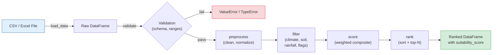

# Tree Species Selector

A decision-support CLI tool that filters, scores, and ranks tree species by climate zone, soil type, rainfall tolerance, and ecological traits -- helping foresters and land-use planners choose the best candidates for reforestation and agroforestry projects.

---

## Features

- **Multi-criteria filtering** -- narrow candidates by climate zone, rainfall range, soil type, native status, drought tolerance, and agroforestry suitability
- **Composite suitability scoring** -- weighted index combining carbon sequestration, growth rate, native status, agroforestry fit, and drought tolerance
- **Configurable weights** -- override default scoring weights via a config dict
- **Immutable pipeline** -- original DataFrames are never mutated; every operation returns a new copy
- **Input validation** -- rejects negative rainfall, invalid climate zones, and malformed data with clear error messages
- **CSV and Excel support** -- load `.csv`, `.xlsx`, or `.xls` files
- **20-species demo dataset** -- realistic tropical, subtropical, temperate, and boreal species included
- **32 pytest tests** -- full coverage of filtering, scoring, ranking, and edge cases

---

## Quick Start

```bash
git clone https://github.com/achmadnaufal/tree-species-selector.git
cd tree-species-selector
python -m venv .venv && source .venv/bin/activate
pip install -r requirements.txt
```

```python
from src.main import SpeciesSelector

selector = SpeciesSelector()
df = selector.load_data("demo/sample_data.csv")
ranked = selector.rank(df, top_n=5)
print(ranked[["rank", "species_name", "suitability_score"]])
```

---

## Usage

### 1. Load and inspect the dataset

```python
from src.main import SpeciesSelector

selector = SpeciesSelector()
df = selector.load_data("demo/sample_data.csv")
print(f"Loaded {len(df)} species")
```

### 2. Filter by environmental criteria

```python
filtered = selector.filter(
    df,
    climate_zone="tropical",
    min_rainfall_mm=1200,
    max_rainfall_mm=2500,
    soil_type="loam",
)
print(filtered[["species_name", "climate_zone", "soil_type", "growth_rate_m_yr"]])
```

### 3. Rank species by suitability score

```python
tropical = selector.filter(df, climate_zone="tropical")
ranked = selector.rank(tropical, top_n=5)
print(ranked[["rank", "species_name", "suitability_score", "growth_rate_m_yr", "carbon_seq_tc_ha_yr"]])
```

### Sample output (real)

```
=== Load Dataset ===
Loaded 20 species from demo/sample_data.csv

=== Filter: Tropical + Loam Soil + Rainfall 1200-2500 mm ===
species_name climate_zone soil_type  growth_rate_m_yr
        Teak     tropical      loam               1.5
 Rubber Tree     tropical      loam               1.0
      Sengon     tropical      loam               3.5
      Durian     tropical      loam               0.8

=== Rank Top 5 Tropical Species ===
 rank species_name  suitability_score  growth_rate_m_yr  carbon_seq_tc_ha_yr
    1       Sengon               95.0               3.5                 13.2
    2       Acacia               82.8               2.5                 11.4
    3        Jabon               78.0               2.8                 10.7
    4   Eucalyptus               65.2               3.0                 12.0
    5         Teak               60.0               1.5                  8.2

=== Full Pipeline Analysis ===
Total records: 20
Columns: ['species_name', 'scientific_name', 'climate_zone', 'min_rainfall_mm',
          'max_rainfall_mm', 'min_temp_c', 'max_temp_c', 'soil_type',
          'growth_rate_m_yr', 'carbon_seq_tc_ha_yr', 'native',
          'drought_tolerant', 'suitable_for_agroforestry']
```

### Running tests

```bash
pytest tests/ -v
```

```
tests/test_selector.py::TestFilterByClimateZone::test_tropical_returns_only_tropical_species PASSED
tests/test_selector.py::TestFilterByClimateZone::test_boreal_returns_only_boreal_species PASSED
tests/test_selector.py::TestFilterByClimateZone::test_climate_zone_is_case_insensitive PASSED
tests/test_selector.py::TestFilterByClimateZone::test_invalid_climate_zone_raises_value_error PASSED
tests/test_selector.py::TestFilterByRainfall::test_min_rainfall_excludes_low_max_rainfall_species PASSED
...
============================== 32 passed in 0.22s ==============================
```

---

## Tech Stack

| Tool | Purpose |
|------|---------|
| **Python 3.9+** | Core language |
| **pandas** | Data loading, filtering, and transformation |
| **NumPy** | Numeric normalization for scoring |
| **pytest** | Unit and integration testing |
| **Rich** | (available) Terminal formatting |
| **openpyxl** | Excel file support |

---

## Architecture



### Data flow

1. **Load** -- `load_data()` reads CSV or Excel into a raw pandas DataFrame.
2. **Validate** -- `validate()` checks for empty data, negative rainfall, and min/max consistency.
3. **Preprocess** -- `preprocess()` normalizes column names, strips whitespace, converts boolean strings, and lowercases categorical fields. Returns a new DataFrame (immutable).
4. **Filter** -- `filter()` applies AND-combined environmental criteria (climate zone, rainfall range, soil type, native, drought-tolerant, agroforestry). Returns a new subset.
5. **Score** -- `score()` computes a 0-100 composite suitability score using configurable weights across carbon sequestration (40%), growth rate (30%), native status (15%), agroforestry suitability (10%), and drought tolerance (5%).
6. **Rank** -- `rank()` sorts by score descending, adds a rank column, and optionally truncates to `top_n`.

---

## Project Structure

```
tree-species-selector/
├── src/
│   ├── __init__.py
│   ├── main.py              # SpeciesSelector core class
│   └── data_generator.py    # Programmatic sample data generator
├── demo/
│   └── sample_data.csv      # 20-row realistic species dataset
├── sample_data/
│   └── sample_data.csv      # Lightweight sample for quick testing
├── tests/
│   ├── __init__.py
│   └── test_selector.py     # 32 pytest assertions
├── examples/
│   └── basic_usage.py       # Runnable usage example
├── data/                    # Drop your own data files here (gitignored)
├── .gitignore
├── CHANGELOG.md
├── LICENSE
├── requirements.txt
└── README.md
```

---

> Built by [Achmad Naufal](https://github.com/achmadnaufal) | Lead Data Analyst | Power BI · SQL · Python · GIS
